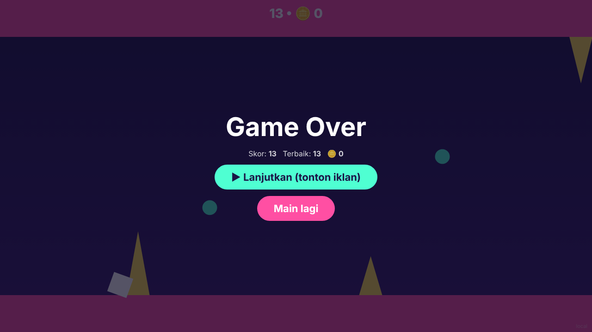
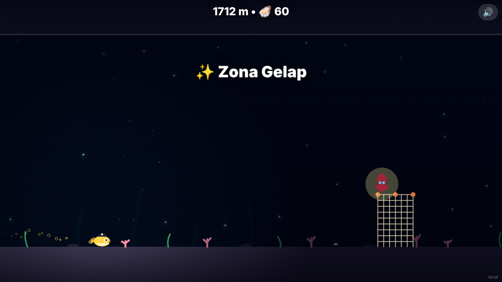
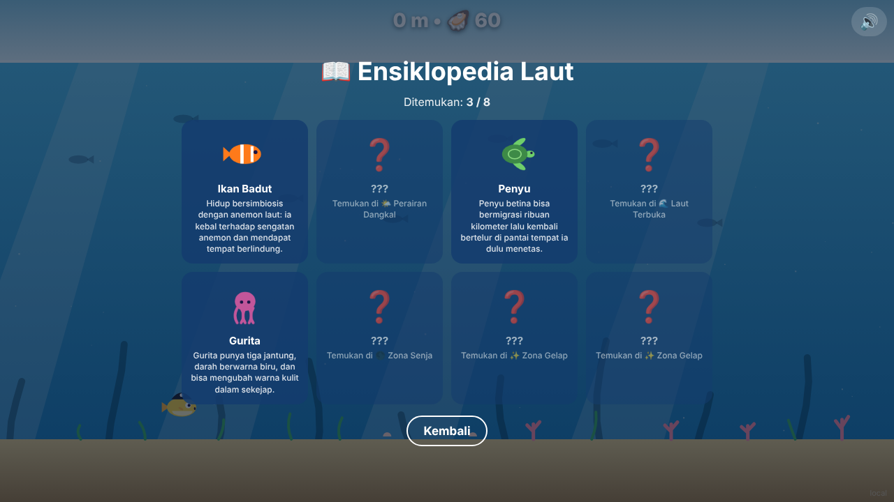
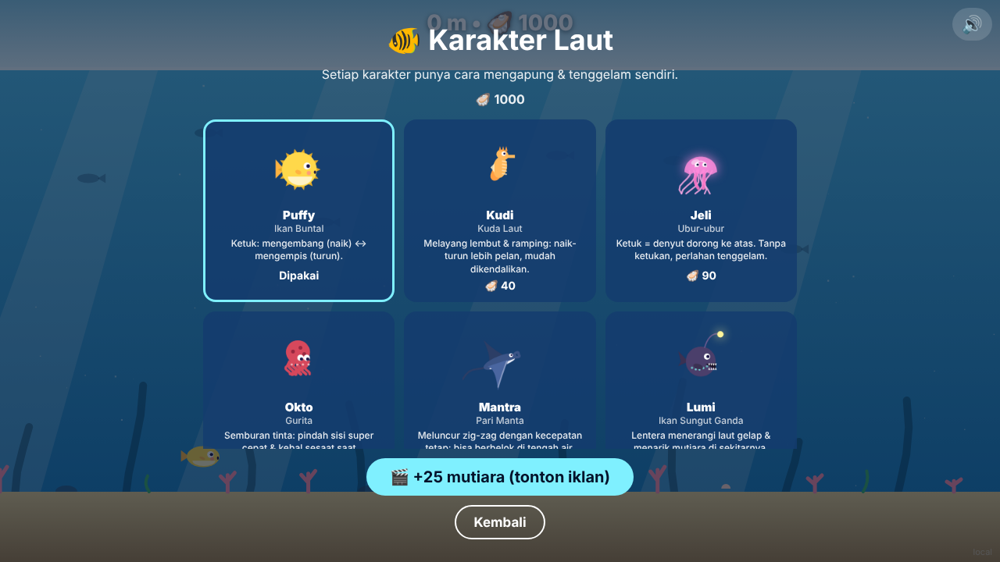

# 🐡 Puffy: Petualangan Laut Dalam

Game web hyper-casual satu tombol (HTML5 + Canvas, tanpa build step, tanpa file aset) dengan **adapter SDK** untuk Poki, CrazyGames, YouTube Playables, dan Facebook Instant Games.



## Konsep
Puffy si ikan buntal menyelam makin dalam. **Tap / klik / Spasi**: Puffy **mengembang** (mengapung ke atas) atau **mengempis** (tenggelam ke bawah). Skor = **kedalaman (m)**.

| Zona | Kedalaman | Bahaya |
|---|---|---|
| 🌤️ Perairan Dangkal | 0–300 m | Bulu babi, karang tajam, es runcing |
| 🌊 Laut Terbuka | 300–800 m | + Ubur-ubur listrik, kail pancing |
| 🌑 Zona Senja | 800–1500 m | + Ikan pedang (didahului tanda "!"), jaring, sampah plastik |
| ✨ Zona Gelap | 1500 m+ | Semua, lebih rapat; laut gelap dengan cahaya di sekitar Puffy |

- **Palung**: lantai/atap hilang. Jatuh = kalah, jadi pindah sisi sebelum palung.
- Warna laut, terrain, dan musik (makin teredam) berubah mengikuti kedalaman.



## Koleksi
- 🦪 **Mutiara**: mata uang untuk membuka **karakter laut baru** (lihat di bawah).
- 🫧 **Gelembung perisai**: kebal satu kali tabrakan/jatuh. Muncul jarang, atau dari rewarded ad "Mulai dengan perisai".
- 📖 **Ensiklopedia Laut**: 8 makhluk langka (2 per zona). Sentuh untuk menemukan dan membaca faktanya.



## Karakter Laut
Setiap karakter punya cara mengapung & tenggelam sendiri. Makin mahal, makin unik mekaniknya dan makin kompleks animasinya.

| Karakter | Harga | Cara bergerak | Animasi |
|---|---|---|---|
| 🐡 Puffy (Ikan Buntal) | Gratis | Ketuk: mengembang (naik) ↔ mengempis (turun) | Duri muncul saat mengembang, sirip mengepak |
| 🐴 Kudi (Kuda Laut) | 🦪 40 | Seperti Puffy tapi lebih pelan & ramping | Ekor menggulung saat turun, sirip punggung bergetar |
| 🪼 Jeli (Ubur-ubur) | 🦪 90 | Ketuk = denyut dorong ke atas, otomatis tenggelam | Lonceng berkontraksi, tentakel tertinggal mengikuti gerak |
| 🐙 Okto (Gurita) | 🦪 150 | Semburan tinta: pindah sisi super cepat + kebal sesaat | Tentakel mengalir saat melesat, kulit berubah warna, awan tinta |
| 🦈 Mantra (Pari Manta) | 🦪 220 | Meluncur zig-zag kecepatan tetap, bisa belok di tengah | Sayap mengepak, ekor mencambuk, tubuh miring |
| 🎣 Lumi (Ikan Sungut Ganda) | 🦪 320 | Seperti Puffy + lentera menerangi laut gelap & menarik mutiara | Umpan berpegas, mulut terbuka saat mutiara dekat, bintik berpendar |

Data karakter (fisika, hitbox, kemampuan, gambar) ada di `src/characters.js`.



## Monetisasi
- Rewarded: lanjutkan setelah kalah, mulai dengan perisai, +25 mutiara di menu karakter.
- Interstitial: tiap 3 kali main ulang, jarak minimal 60 detik.
- Suara & musik otomatis dibisukan selama iklan.

## Menjalankan
```bash
python3 -m http.server 8000 --bind 127.0.0.1
# buka http://localhost:8000/?platform=local
# uji zona dalam: http://localhost:8000/?start=1000
```
`?platform=` bisa `poki`, `crazygames`, `youtube`, `facebook`, atau `local` (iklan simulasi).

## Struktur
- `src/game.js`: alur game, fisika Puffy, perisai, penemuan, UI
- `src/world.js`: terrain, palung, zona, bahaya, pickup, semua rendering dunia
- `src/characters.js`: 6 karakter laut (mode gerak, kemampuan, animasi)
- `src/creatures.js`: makhluk Ensiklopedia Laut + faktanya
- `src/particles.js`: gelembung, kilau, ledakan
- `src/audio.js`: efek suara & musik sintetis (Web Audio API)
- `src/sdk/adapter.js`: satu antarmuka untuk semua platform

## Sebelum submit
- Facebook: isi `FB_INTERSTITIAL_ID` / `FB_REWARDED_ID` di `src/sdk/adapter.js` dan tambahkan `fbapp-config.json`.
- YouTube Playables: hanya iklan dari SDK YouTube, tanpa pembelian dalam game.
