# 🐡 Puffy: Petualangan Laut Dalam

Game web hyper-casual satu tombol (HTML5 + Canvas, tanpa build step, tanpa file aset) dengan **adapter SDK** untuk Poki, CrazyGames, YouTube Playables, dan Facebook Instant Games.


## Konsep
Puffy si ikan buntal menyelam makin dalam. **Tap / klik / Spasi**: Puffy **mengembang** (mengapung ke atas) atau **mengempis** (tenggelam ke bawah). Skor = **kedalaman (m)**.

| Zona | Kedalaman | Bahaya |
|---|---|---|
| 🌤️ Perairan Dangkal | 0–300 m | Bulu babi, karang tajam, es runcing |
| 🌊 Laut Terbuka | 300–800 m | + Ubur-ubur listrik, kail pancing |
| 🌑 Zona Senja | 800–1500 m | + Ikan pedang (didahului tanda "!"), jaring, sampah plastik |
| ✨ Zona Gelap | 1500 m+ | Semua, lebih rapat; laut gelap dengan cahaya di sekitar Puffy |

- **Palung**: lantai/atap hilang. Jatuh = kalah, jadi pindah sisi sebelum palung.
- Warna laut, terrain, dan musik (makin teredam) berubah mengikuti kedalaman.


## ⚖️ Peran kedua mode & ekonomi mutiara
Satu kantong mutiara untuk semua, dipakai membeli karakter.

| | ♾️ Mode Bebas — *jelajahi laut* | 🗺️ Petualangan — *taklukkan tantangan* |
|---|---|---|
| Mutiara yang diambil | Langsung masuk kantong | Dihitung untuk ★★, dibayar lewat **bonus bintang baru** (tidak bisa ditambang dengan mengulang level) |
| 📖 Makhluk Ensiklopedia | ✅ Hanya di sini | ❌ |
| Momen langka | ✅ +5 🦪 | Tetap tampil, tanpa hadiah |
| Rekor kedalaman / bintang & bos | Rekor | Bintang & bos |
| Misi harian & streak | ✅ | ✅ |

Harga karakter dirancang agar karakter terakhir jadi target ± 1–2 minggu bermain rutin (± 350–450 🦪/hari dari menyelam, misi & streak). Tombol iklan **+40 🦪** dibatasi **5× per hari**.

## 🗺️ Mode Petualangan (level)
Selain **♾️ Mode Bebas** (endless), ada **20 level** (5 per zona) dengan garis **FINISH** dan progress bar.
- Setiap level punya **susunan tetap** (seed), jadi bisa dihafal dan diulang untuk bintang lebih banyak.
- Level ke-5 tiap zona adalah **Ujian** (lebih panjang & sulit, tombol ungu).
- ★ sampai finish · ★★ + kumpulkan ≥70% mutiara · ★★★ + tanpa kalah, yaitu tidak memakai "Lanjutkan" (perisai yang pecah tidak mengurangi bintang).
- Hadiah mutiara untuk setiap bintang baru (10 + 2×nomor level). Level berikutnya terbuka setelah level sebelumnya selesai.
- **Bos di setiap level Ujian** (`src/bosses.js`): tidak bisa dilawan, tujuannya **bertahan sampai 🏁**. Setiap serangan menyasar **lajur atas atau bawah**; lajur itu **berkedip merah** dulu (~1 detik) → pindah ke sisi lain!

  | Level | Bos | Serangan |
  |---|---|---|
  | 5 | 🦀 Kepiting Raksasa | Capit raksasa menyapu dari kanan |
  | 10 | 🦈 Hiu Martil | Menyeruduk dari belakang |
  | 15 | 🐙 Gurita Raksasa | Tentakel muncul dari atas/bawah tepat di depan (ditandai gelembung) |
  | 20 | 🎣 Anglerfish Raksasa | Menerkam dari belakang dengan rahang terbuka |

  Serangan makin sering mendekati finish. Rintangan biasa di level Ujian dikurangi supaya bos jadi tantangan utamanya.

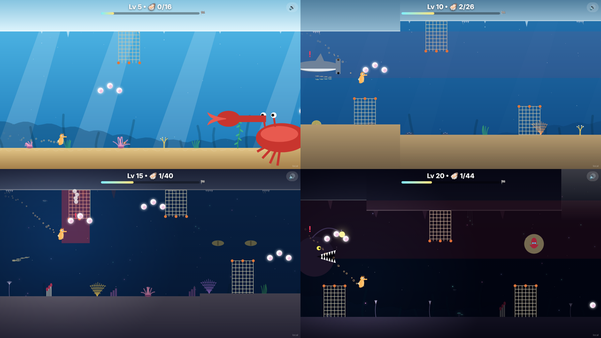

- **Pola mutiara mengikuti posisi level di dalam zona** (tier 0–4): level pertama tiap zona (1, 6, 11, 16) hanya garis lurus/deretan dasar-atas, lalu bukit & lembah, diagonal, gelombang, sampai zig-zag rapat di level Ujian. Setiap zona dimulai mudah lagi. Di Mode Bebas tier mengikuti seberapa jauh kamu masuk ke zona.
- Data level ada di `src/levels.js`. Uji cepat layar selesai: `?finish=25` (semua level jadi 25 m).

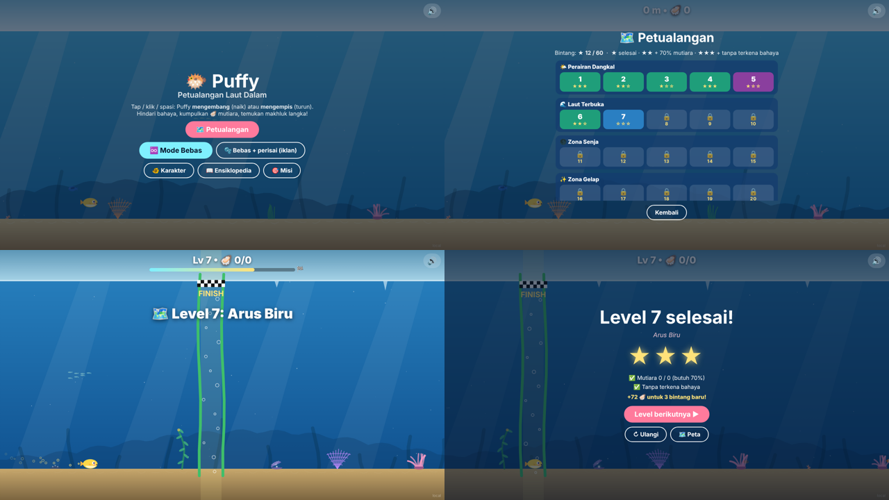

## Latar laut yang hidup
Prinsip: **latar mendukung, bukan bersaing.** Hiasan dibuat lebih jarang dan sedikit transparan, awal permainan sengaja tenang, sehingga bahaya, mutiara, dan karakter selalu paling menonjol.

- **Ikan latar** (`src/ambient.js`) per zona di beberapa lapisan parallax: ikan tang, kepe-kepe, angelfish, wrasse, kawanan sarden, penyu, pari, barakuda, ikan kapak perak, ikan lentera bercahaya, cumi, sifonofor bercahaya, dan siluet anglerfish raksasa. Ekor mengibas; sengaja dibuat sedikit, kecil, dan samar agar tidak mengalihkan fokus dari bahaya & mutiara.
- **Dasar laut** (`src/decor.js`): kelp bergoyang, lamun, karang bercabang dengan polip berdenyut, karang otak, kipas laut, anemon (dengan ikan badut yang **bersembunyi** saat Puffy lewat), bintang laut, kima yang **menutup** saat didekati, spons, **cacing tabung yang masuk ke tabungnya**, lili laut, jamur bercahaya, dan cerobong hidrotermal berasap.
- **Langit-langit**: es runcing & tetesan air (dangkal), teritip yang menjulurkan kaki, stalaktit, dan benang cacing bercahaya (dalam).
- **Pemandangan jauh**: punggung terumbu, siluet kapal karam, dan pantulan cahaya (*caustics*) di pasir perairan dangkal.

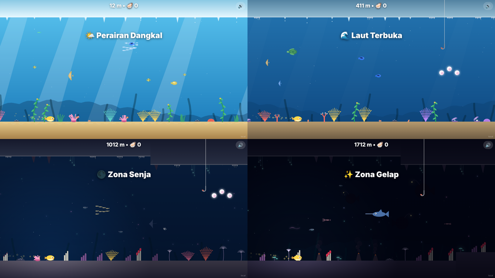

## ✨ Momen langka
Sesekali (sekitar tiap 40–75 detik) terjadi peristiwa besar di latar, sesuai zona. Saksikan sampai selesai untuk **+5 🦪** (ada juga misi "Saksikan 2 momen langka"). Kode: `src/moments.js`, uji dengan `?moment=humpback`.

| Momen | Zona |
|---|---|
| 🐬 Kawanan lumba-lumba melompat-lompat | Dangkal |
| 🌀 Pusaran ribuan ikan kecil (*bait ball*) | Dangkal, Terbuka |
| 🐋 Paus bungkuk melintas dengan sirip panjang & nyanyian paus | Dangkal, Terbuka |
| 🐳 Paus sperma menyelam ke kedalaman | Terbuka, Senja |
| 🦑 Cumi-cumi raksasa dengan tentakel panjang | Senja, Gelap |
| 🪼 Ubur-ubur raksasa bercahaya naik dari jurang | Gelap |
| ✨ Gelombang cahaya bioluminesensi | Senja, Gelap |

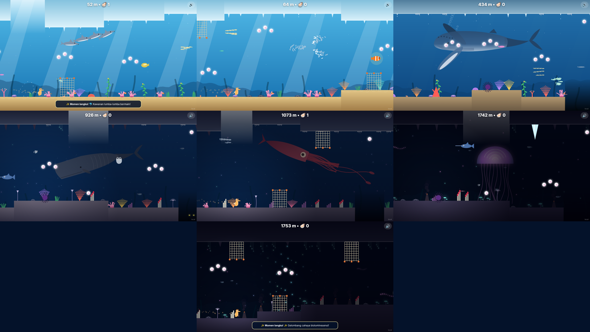

## Animasi kekalahan
Setiap bahaya punya animasi & suara sendiri sebelum layar Game Over, plus keterangan penyebabnya (`src/deaths.js`):

| Bahaya | Animasi |
|---|---|
| 🦔 Bulu babi / 🪸 karang / ❄️ es runcing | Tertusuk: berkedip merah, bocor udara & meluncur zig-zag seperti balon kempis |
| 🪼 Ubur-ubur listrik | Tersetrum: bergetar, berkedip putih-kuning dengan petir, lalu gosong & berasap |
| 🎣 Kail pancing | Tersangkut di mulut lalu ditarik naik keluar layar |
| 🕸️ Jaring | Jaring membungkus, karakter meronta, lalu diangkut ke atas |
| 🗡️ Ikan pedang | Benturan bintang, terpental berputar ke belakang dengan bintang pusing |
| 🛍️ Sampah plastik | Terbungkus kantong plastik dan melayang tak berdaya |
| 🧱 Dinding | "Gedebuk": gepeng menempel, bintang pusing, lalu merosot |
| 🕳️ Palung bawah | Berputar mengecil ke kegelapan, rahang bermata kuning menutup |
| ☀️ Palung atas | Terlempar keluar dari air dengan cipratan |

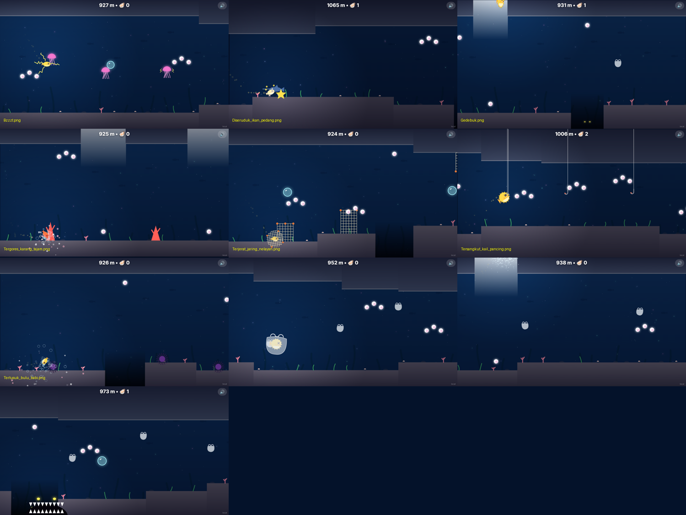

## 🎯 Misi harian
Setiap hari 3 misi baru (2 lucu + 1 biasa, sama untuk satu hari penuh), hadiah mutiara. Klaim biasa atau **x2 lewat rewarded ad**. Tombol 🎯 Misi menampilkan badge jumlah hadiah yang siap diambil.

- 😜 Lucu: kesetrum ubur-ubur 3×, tertangkap kail, terbungkus plastik, terjerat jaring, diseruduk ikan pedang, jadi camilan penghuni palung, terlempar keluar air, gedebuk ke dinding, kempis tertusuk duri, kalah sebelum 50 m, mengembang-mengempis 100× dalam satu selaman.
- Biasa: kumpulkan 50 mutiara, capai 500 m, pakai kemampuan 5×, sapa 3 makhluk langka, pecahkan 2 perisai, main dengan 2 karakter berbeda.

Daftar misi ada di `src/missions.js` (tinggal tambah objek baru ke `POOL`).

### 🔥 Streak harian
Selesaikan **ketiga** misi hari ini → streak +1 (kalau kemarin juga selesai) dan dapat **bonus streak**. Bolos sehari → streak kembali ke 0.

| Hari | 1 | 2 | 3 | 4 | 5 | 6 | 7 🎁 |
|---|---|---|---|---|---|---|---|
| Bonus 🦪 | 20 | 30 | 40 | 50 | 60 | 80 | 150 |

Siklus 7 hari berulang. Bonus bisa diambil biasa atau x2 lewat rewarded ad.

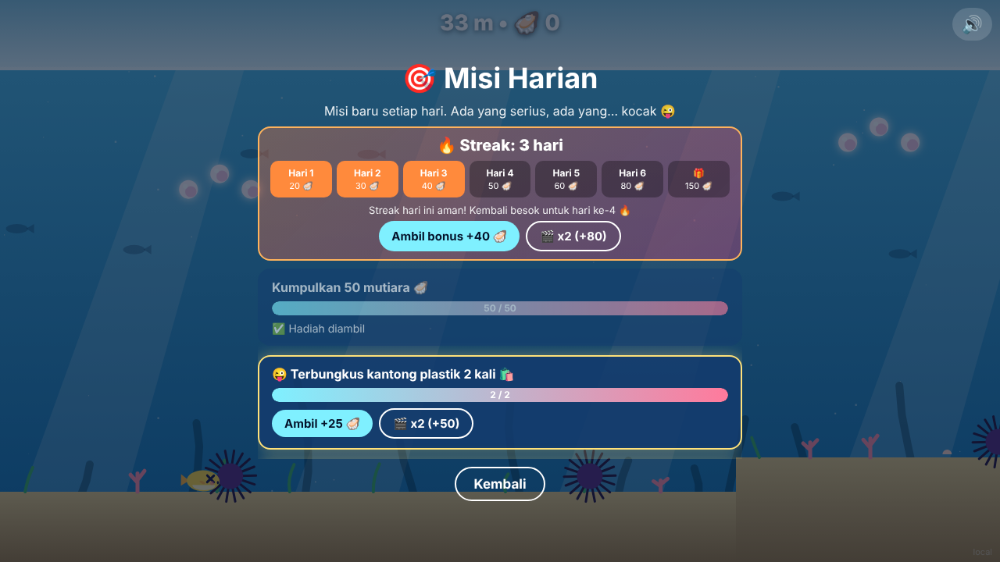

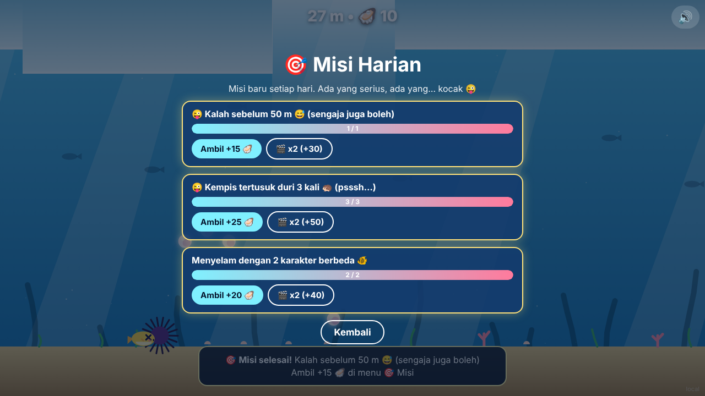

## Koleksi
- 🦪 **Mutiara**: mata uang untuk membuka **karakter laut baru** (lihat di bawah).
- 📖 Makhluk langka Ensiklopedia hanya muncul di **♾️ Mode Bebas**.
- 🫧 **Gelembung perisai**: kebal satu kali tabrakan/jatuh. Muncul jarang, atau dari rewarded ad "Mulai dengan perisai".
- 📖 **Ensiklopedia Laut**: 8 makhluk langka (2 per zona). Sentuh untuk menemukan dan membaca faktanya.


## Karakter Laut
Setiap karakter punya cara mengapung & tenggelam sendiri. Makin mahal, makin unik mekaniknya dan makin kompleks animasinya.

| Karakter | Harga | Cara bergerak | Animasi |
|---|---|---|---|
| 🐡 Puffy (Ikan Buntal) | Gratis | Ketuk: mengembang (naik) ↔ mengempis (turun) | Duri muncul saat mengembang, sirip mengepak |
| 🐴 Kudi (Kuda Laut) | 🦪 150 | Seperti Puffy tapi lebih pelan & ramping | Ekor menggulung saat turun, sirip punggung bergetar |
| 🪼 Jeli (Ubur-ubur) | 🦪 400 | Ketuk = denyut dorong ke atas, otomatis tenggelam | Lonceng berkontraksi, tentakel tertinggal mengikuti gerak |
| 🐙 Okto (Gurita) | 🦪 900 | Semburan tinta: pindah sisi super cepat + kebal sesaat | Tentakel mengalir saat melesat, kulit berubah warna, awan tinta |
| 🦈 Mantra (Pari Manta) | 🦪 1600 | Meluncur zig-zag kecepatan tetap, bisa belok di tengah | Sayap mengepak, ekor mencambuk, tubuh miring |
| 🎣 Lumi (Ikan Sungut Ganda) | 🦪 2500 | Seperti Puffy + lentera menerangi laut gelap & menarik mutiara | Umpan berpegas, mulut terbuka saat mutiara dekat, bintik berpendar |

### 🗡️ Skill aktif (Mode Bebas)
Tombol bulat **⚡ kanan bawah** (atau tombol **X**). Setelah dipakai, tombol mengisi ulang (cooldown) sambil menampilkan hitung mundur. Tidak tersedia di Petualangan — di sana bos tetap ditaklukkan dengan bertahan sampai 🏁.

| Karakter | Skill | Efek | Cooldown |
|---|---|---|---|
| 🐡 Puffy | 🦔 Ledakan Duri | Duri menyembur ke segala arah, memecahkan bahaya di sekitar | 12 dtk |
| 🐴 Kudi | 🌀 Pusaran Ekor | Menyedot semua mutiara di layar, menghalau ubur-ubur & plastik di dekatnya | 12 dtk |
| 🪼 Jeli | ⚡ Setrum Balik | Gelombang listrik ke depan menghancurkan bahaya di jalurnya | 14 dtk |
| 🐙 Okto | 🐙 Lengan Gurita | Tentakel meraih & melempar hingga 3 bahaya terdekat di depan | 12 dtk |
| 🦈 Mantra | 💨 Sayap Penerjang | Menerjang 2 detik: kebal & menembus bahaya yang ditabrak | 15 dtk |
| 🎣 Lumi | 🔦 Sorot Lentera | Membekukan semua bahaya di layar selama 3 detik | 18 dtk |
| 🐋 Bubu | 🌊 Semburan Paus | Menyapu bersih semua bahaya di layar | 20 dtk |

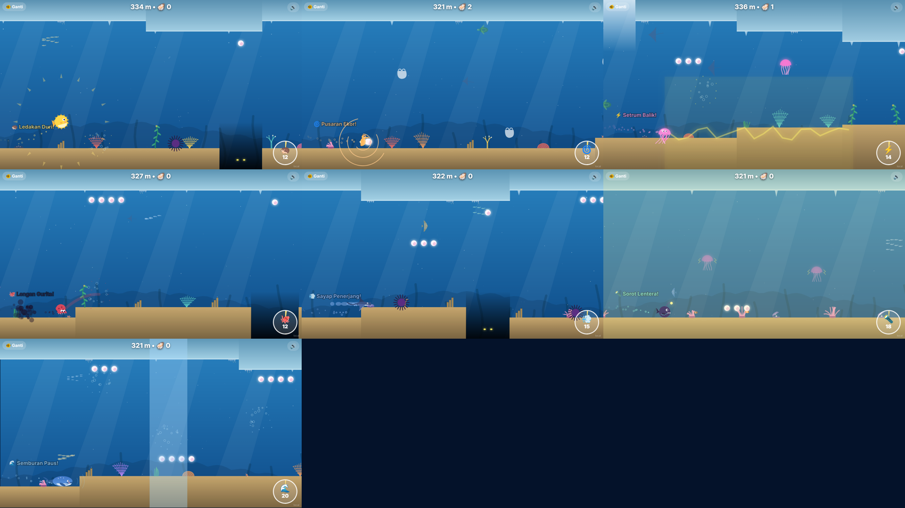

### 🔄 Ganti karakter di tengah penyelaman (Mode Bebas)
Tombol **🐠 Ganti** (kiri atas, atau tombol **C**) menjeda permainan dan menampilkan karakter yang dimiliki beserta kemampuannya. Setelah berganti: kebal 1 detik, lalu jeda 8 detik sebelum bisa ganti lagi. Tidak tersedia di Petualangan.

### ⚡ Kemampuan khusus (terkait bahaya)
| Karakter | Kemampuan |
|---|---|
| 🐡 Puffy | Saat mengembang, **ikan pedang memantul** dari durinya |
| 🐴 Kudi | Tubuh ramping: **lolos dari jaring** |
| 🪼 Jeli | **Kebal ubur-ubur listrik** (sesama ubur-ubur) |
| 🐙 Okto | Tinta **membutakan ikan pedang** & **membekukan ubur-ubur** di dekatnya |
| 🦈 Mantra | Kulit licin & pipih: **kail pancing meleset** |
| 🎣 Lumi | Menangkap **sampah plastik** untuk dibuang: laut bersih +2 🦪 |

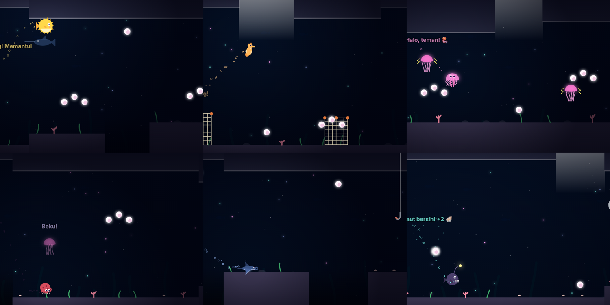

### 🐋 Karakter rahasia: Bubu si Paus Biru Mini
Terbuka **gratis** setelah semua 8 makhluk di 📖 Ensiklopedia Laut ditemukan. Sebelum itu tampil sebagai siluet "???" dengan progres (mis. 7/8).
- Gerak: naik-turun sedang, badan besar; menyembur dari lubang napas saat naik.
- ⚡ **Nyanyian paus** tiap 6 detik: gelombang sonar yang mengusir ikan pedang & kail dan membekukan ubur-ubur di sekitarnya.

| Terkunci | Bermain |
|---|---|
| 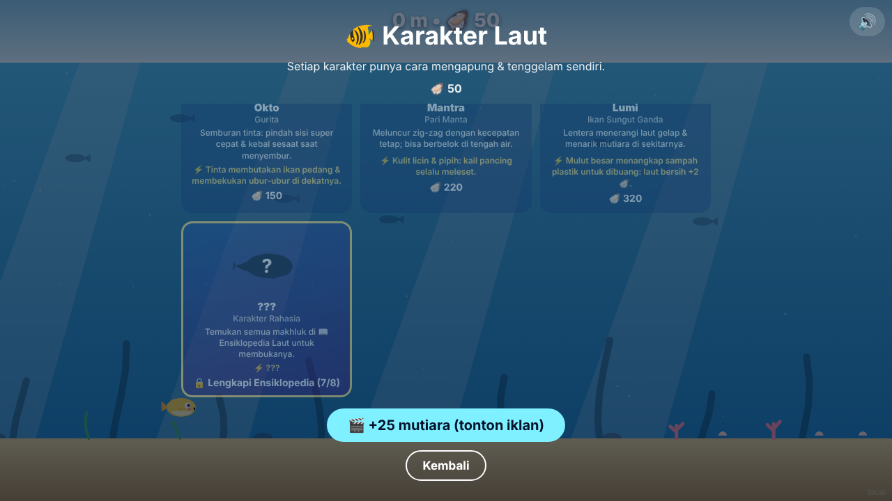 | 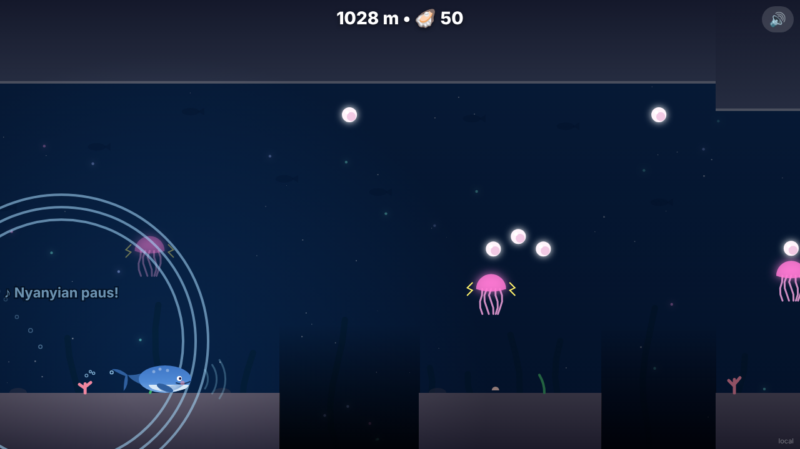 |

Data karakter (fisika, hitbox, kemampuan, gambar) ada di `src/characters.js`.


## Monetisasi
- Rewarded: lanjutkan setelah kalah, mulai dengan perisai, +40 mutiara di menu karakter (maks. 5×/hari), hadiah misi x2.
- Interstitial: tiap 3 kali main ulang, jarak minimal 60 detik.
- Suara & musik otomatis dibisukan selama iklan.

## Menjalankan
```bash
python3 -m http.server 8000 --bind 127.0.0.1
# buka http://localhost:8000/?platform=local
# uji zona dalam: http://localhost:8000/?start=1000
# uji kemampuan: http://localhost:8000/?start=1000&hazard=jelly  (urchin, coral, icicle, jelly, hook, sword, net, bag)
```
`?platform=` bisa `poki`, `crazygames`, `youtube`, `facebook`, atau `local` (iklan simulasi).

## Struktur
- `src/game.js`: alur game, fisika Puffy, perisai, penemuan, UI
- `src/world.js`: terrain, palung, zona, bahaya, pickup, semua rendering dunia
- `src/characters.js`: 6 karakter laut (mode gerak, kemampuan, animasi)
- `src/creatures.js`: makhluk Ensiklopedia Laut + faktanya
- `src/missions.js`: misi harian & hadiahnya
- `src/deaths.js`: animasi kekalahan per bahaya
- `src/particles.js`: gelembung, kilau, ledakan
- `src/audio.js`: efek suara & musik sintetis (Web Audio API)
- `src/sdk/adapter.js`: satu antarmuka untuk semua platform

## Sebelum submit
- Facebook: isi `FB_INTERSTITIAL_ID` / `FB_REWARDED_ID` di `src/sdk/adapter.js` dan tambahkan `fbapp-config.json`.
- YouTube Playables: hanya iklan dari SDK YouTube, tanpa pembelian dalam game.
